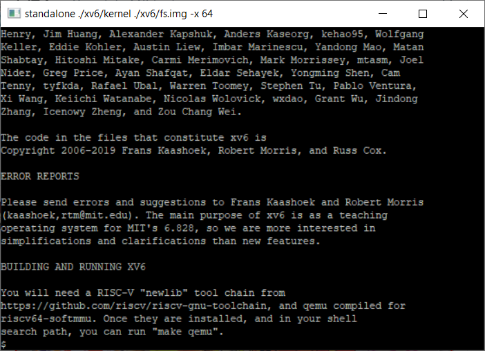
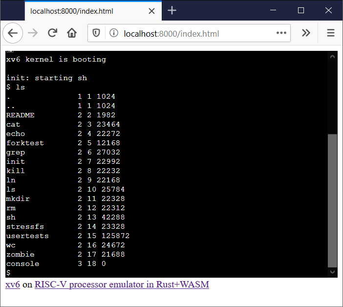

# riscv-rust

riscv-rust is a [RISC-V](https://riscv.org/) processor emulator project written in Rust

## Demo

[Online demo with xv6](https://takahirox.github.io/riscv-rust/index.html)

## Screenshots





## Instructions/Features support status

- [x] RV32/64I
- [x] RV32/64M
- [ ] RV32/64F
- [ ] RV32/64D
- [ ] RV32/64Q
- [ ] RV32/64A
- [ ] RV32/64C
- [ ] RV32/64Zifencei
- [ ] RV32/64Zixsr
- [ ] CSR
- [x] SV32
- [x] SV39
- [ ] SV48
- [ ] Privileged instructions

etc...

## How to build and run

**Attension!! You are not recommended to read the code now because it is super dirty. It will be cleaned up soon.**

### Standalone

```sh
$ cargo run --release xv6/kernel xv6/fs.img
```

### WebAssembly

Prerequirements
- Install [wasm-bindgen client](https://rustwasm.github.io/docs/wasm-bindgen/)

```sh
$ cargo build --release --lib --target wasm32-unknown-unknown
$ wasm-bindgen ./target/wasm32-unknown-unknown/release/riscv_rust.wasm --out-dir ./wasm/ --target web --no-typescript
# boot local server and access index.html
```

## How to run test

**Broken now. Will be fixed soon.**

Prerequirements
- Install [riscv-gnu-toolchain](https://github.com/riscv/riscv-gnu-toolchain)
- Install [riscv-tests](https://github.com/riscv/riscv-tests)

```sh
$ git clone https://github.com/takahirox/riscv-rust.git
$ cd riscv-rust
$ vi build_tests.sh # edit the path to the installed riscv-tests
$ bash build_test.sh
$ cargo run ./tests/rv32ui-p-add -x 32
$ cargo run ./tests/rv64ui-p-add -x 64
```
