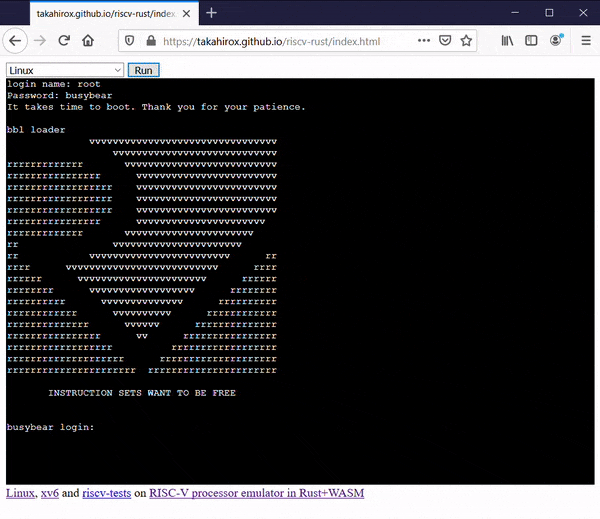
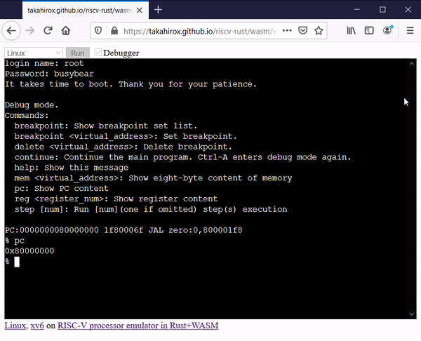

# riscv-rust

[](https://travis-ci.org/takahirox/riscv-rust)
[](https://crates.io/crates/riscv_emu_rust)
[](https://badge.fury.io/js/riscv_emu_rust_wasm)

riscv-rust is a [RISC-V](https://riscv.org/) processor and peripheral devices emulator project written in Rust and compiled to WebAssembly. You can import RISC-V emulator into your Rust or JavaScript project. Refer to the [Slides](https://docs.google.com/presentation/d/1qeR6KMSaJTR0ZSa2kLxgcBuc_zBo3l-kYbOpq1Wqmi0/edit?usp=sharing) for more detail.

## Online Demo

You can run Linux or xv6 on the emulator in your browser. [Online demo is here](https://takahirox.github.io/riscv-rust/wasm/web/index.html)

## Screenshots




## Documents

* [Document](https://docs.rs/riscv_emu_rust/0.2.0/riscv_emu_rust/)

## Features

- Emulate RISC-V processor and peripheral devices
- Stable as [Linux](https://risc-v-getting-started-guide.readthedocs.io/en/latest/linux-qemu.html) and [xv6-riscv](https://github.com/mit-pdos/xv6-riscv) run on it
- Runnable locally
- Also runnable in browser with WebAssembly
- Debugger
- You can import RISC-V emulator into your Rust or JavaScript project

## Instructions/Features support status

- [x] RV32/64I
- [x] RV32/64M
- [x] RV32/64F (almost)
- [x] RV32/64D (almost)
- [ ] RV32/64Q
- [x] RV32/64A (almost)
- [x] RV64C/32C (almost)
- [x] RV32/64Zifencei (almost)
- [x] RV32/64Zicsr (almost)
- [x] CSR (almost)
- [x] SV32/39
- [ ] SV48
- [x] Privileged instructions (almost)
- [ ] PMP

etc...

The emulator supports almost all instructions listed above but some instructions which are not used in Linux or xv6 are not implemented yet. Contribution is very welcome.

## How to import into your Rust project

The emulator module is released at [crates.io](https://crates.io/crates/riscv_emu_rust
). Add the following line into Cargo.toml of your Rust project.

```
[dependencies]
riscv_emu_rust = "0.2.0"
```

Refer to [Document](https://docs.rs/riscv_emu_rust/0.2.0/riscv_emu_rust/struct.Emulator.html) for the API.

## How to build core library locally

```sh
$ git clone https://github.com/takahirox/riscv-rust.git
$ cd riscv-rust
$ cargo build --release
```

## How to run Linux or xv6 as desktop application

```sh
$ cd riscv-rust/cli
# Run Linux
$ cargo run --release ../resources/linux/bbl -f ../resources/linux/busybear.bin
# Run xv6
$ cargo run --release ../resources/xv6/kernel -f ../resources/xv6/fs.img
```

## How to run riscv-tests

Prerequirements
- Install [riscv-gnu-toolchain](https://github.com/riscv/riscv-gnu-toolchain)
- Install [riscv-tests](https://github.com/riscv/riscv-tests)

```sh
$ cd riscv-rust/cli
$ cargo run $path_to_riscv_tets/isa/rv32ui-p-add -n
```

## How to import and use WebAssembly RISC-V emulator in a web browser

See [wasm/web](https://github.com/takahirox/riscv-rust/tree/master/wasm/web)

## How to install and use WebAssembly RISC-V emulator npm package

See [wasm/npm](https://github.com/takahirox/riscv-rust/tree/master/wasm/npm)

## Links

### Linux RISC-V port

[Linux RISC-V port](https://risc-v-getting-started-guide.readthedocs.io/en/latest/linux-qemu.html)

### xv6-riscv

[xv6-riscv](https://github.com/mit-pdos/xv6-riscv) is the RISC-V port of [xv6](https://pdos.csail.mit.edu/6.828/2019/xv6.html) which is UNIX V6 rewritten by MIT for x86 in the current C language.

### Specifications

- [RISC-V ISA](https://riscv.org/specifications/)
- [Virtio Device](https://docs.oasis-open.org/virtio/virtio/v1.1/csprd01/virtio-v1.1-csprd01.html)
- [UART](http://www.ti.com/lit/ug/sprugp1/sprugp1.pdf)
- [CLINT, PLIC (SiFive E31 Manual)](https://sifive.cdn.prismic.io/sifive%2Fc89f6e5a-cf9e-44c3-a3db-04420702dcc1_sifive+e31+manual+v19.08.pdf)
- [SiFive Interrupt Cookbook](https://sifive.cdn.prismic.io/sifive/0d163928-2128-42be-a75a-464df65e04e0_sifive-interrupt-cookbook.pdf)
